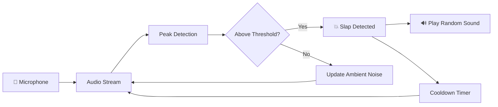

<p align="center">
  
</p>

<p align="center">
  
  
  
  
</p>

<p align="center">
  
  
  
</p>

---

<div align="center">

### 🎯 A real-time slap detection app for **Windows** that listens through your microphone, detects sharp impact sounds, and plays hilarious audio reactions.

*Built for Windows PCs • Real-time detection • Fun party trick 🎉*

</div>

---

#  Features

<table>
<tr>
<td width="50%">

### 🎤 Real-Time Audio Detection

Continuously monitors your microphone and processes audio blocks in real time to detect **sudden slap sounds** with minimal latency.

</td>
<td width="50%">

###  Live Visual Meter

```
🎤 [████████░░░░░░░░░░░░░░░░░░░░░░] peak=0.203
💥 SLAP DETECTED! Playing: meme_01.wav
```

Real-time terminal visualization of microphone intensity.

</td>
</tr>

<tr>
<td width="50%">

###  Adaptive Noise Detection

Automatically adapts to background noise using an **ambient noise baseline** so it works in quiet rooms and noisy environments.

</td>

<td width="50%">

### Random Sound Reactions

Drop `.wav` or `.mp3` files into the `audio/` folder and the program will **play a random sound** whenever a slap is detected.

</td>
</tr>
</table>

---

#  Quick Start

## Requirements

* **Windows 10 / Windows 11**
* **Python 3.9+**
* **Microphone**

---

# Installation

```bash
git clone https://github.com/1sarthak7/slap-detector-for-windows.git
cd slap-detector-for-windows

pip install sounddevice numpy playsound
```

---

# Run

```bash
python slap.py
```

Once running:

```
🎤 Listening for slaps...
```

Now **slap your desk or table** near the microphone and enjoy the reaction.

---

# ⚙️ Configuration

Edit these parameters at the top of `slap.py`:

| Parameter     | Default | Description                                   |
| ------------- | ------- | --------------------------------------------- |
| `THRESHOLD`   | `0.35`  | Minimum amplitude required to trigger         |
| `SPIKE_RATIO` | `3.0`   | How much louder than ambient the slap must be |
| `COOLDOWN`    | `1.0`   | Minimum seconds between triggers              |
| `SAMPLE_RATE` | `44100` | Microphone sample rate                        |
| `BLOCK_SIZE`  | `1024`  | Samples per analysis block                    |

---

# 🔧 Tuning Tips

```
Too many triggers? → Increase THRESHOLD
Missing slaps?     → Lower THRESHOLD
Double triggers?   → Increase COOLDOWN
Noisy room?        → Increase SPIKE_RATIO
```

---

# 📂 Project Structure

```
slap-detector-for-windows/
│
├── slap.py
├── audio/
│   ├── meme/
│   ├── pain/
│   └── random/
│
├── README.md
└── requirements.txt
```

---

#  How It Works



### Steps

1. Capture microphone audio
2. Analyze peak amplitude of each block
3. Compare against ambient noise baseline
4. If spike detected → trigger reaction
5. Play random sound from `audio/`

---

##  Contributing

<p align="center">
  <a href="https://github.com/1sarthak7/slap-detection-mac/issues">
    
  </a>
  <a href="https://github.com/1sarthak7/slap-detection-mac/issues">
    
  </a>
</p>

---

<p align="center">
  
</p>

<p align="center">
  <a href="https://github.com/1sarthak7">
    
  </a>
</p>

<p align="center">
  ⭐ Star this repo if you enjoyed slapping Your lappy !
</p>
 
